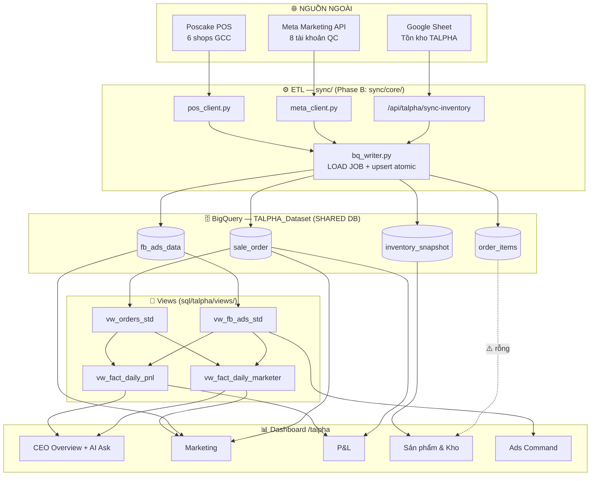

# TALPHA — Tài Liệu Kỹ Thuật Chi Tiết

> Audience: Dev / Ops / Leader. Cập nhật: 2026-06-19.
> File này là reference chi tiết. Kiến trúc tổng thể xem `ARCHITECTURE_2026.md`.

---

## 1. Thông Tin Dự Án

| Thuộc tính | Giá trị |
|:--|:--|
| Project ID | `talpha` |
| Tên | Tiểu Alpha |
| Mô tả | Trang sức + mỹ phẩm cho phụ nữ Philippines tại thị trường GCC |
| Thị trường | Saudi Arabia · UAE · Kuwait · Oman · Qatar · Bahrain |
| Kênh bán | Facebook Ads + Chat-sale (Messenger/WhatsApp) + COD |
| Mô hình | Performance ads → Chat qualify → Giao COD → Thu hồi |
| Ngành | Trang sức (12 SKU) + Mỹ phẩm/skincare (15 SKU) = 27 SKU |
| Nhân sự | 7 marketer |

---

## 2. Google Cloud / BigQuery

### 2.1 Thông tin kết nối

| Tham số | Giá trị |
|:--|:--|
| GCP Project | `cty-507710` |
| Dataset | `TALPHA_Dataset` |
| Location | `US` |
| Service Account | `bigquery_key.json` ở root repo |
| Biến môi trường | `BQ_PROJECT_ID=cty-507710` · `BQ_DATASET=TALPHA_Dataset` |

### 2.2 Bảng dữ liệu

#### `sale_order` — Đơn hàng (nguồn chính)

| Cột | Kiểu | Mô tả |
|:--|:--|:--|
| `id` | STRING | ID đơn hàng (PRIMARY KEY) |
| `shop_id` | STRING | ID shop Poscake |
| `shop_label` | STRING | Market code: `AE/SA/KW/OM/QA/BH` |
| `status_name` | STRING | Status gốc từ POS |
| `status_category` | STRING | Category đã map: `GIAO_THANH_CONG / DANG_GIAO / DON_HOAN / HUY / DON_THO / DA_XAC_NHAN / CHO_HANG / DA_DAT_HANG` |
| `cod` | FLOAT64 | ⚠️ Giá ×100 (POS convention). Doanh thu = `cod/100`. Đơn vị: tiền tệ local |
| `money_to_collect` | FLOAT64 | Tương tự cod, dùng làm backup |
| `total_price` | FLOAT64 | ⚠️ = 0 cho đơn đã giao. KHÔNG dùng để tính DT |
| `shipping_fee` | FLOAT64 | ⚠️ = cod (rác). KHÔNG dùng để tính chi phí vận chuyển |
| `marketer` | STRING | JSON string `{"name":"Hồ Sỹ Anh","id":...}` |
| `ad_id` | STRING | FB ad_id kiểu STRING (khác với fb_ads_data.ad_id INT64) |
| `order_currency` | STRING | Đơn vị tiền tệ: SAR/AED/KWD/OMR/QAR/BHD |
| `inserted_at` | STRING | Timestamp UTC dạng `2026-01-15T10:30:00.000Z` |
| `updated_at` | STRING | Timestamp UTC cập nhật cuối |
| `sync_time` | TIMESTAMP | Thời điểm sync vào BQ |
| `customer_id` | STRING | ID khách hàng |
| `bill_full_name` | STRING | Tên người nhận |
| `bill_phone_number` | STRING | SĐT người nhận |

#### `fb_ads_data` — Dữ liệu quảng cáo Meta

| Cột | Kiểu | Mô tả |
|:--|:--|:--|
| `date` | DATE | Ngày (KHÔNG phải date_start) |
| `account_id` | STRING | ID tài khoản quảng cáo |
| `account_name` | STRING | Tên tài khoản QC |
| `campaign_id` | STRING | ID campaign |
| `campaign_name` | STRING | Tên campaign |
| `adset_id` | STRING | ID adset |
| `ad_id` | INT64 | ⚠️ Kiểu INT64 (khác sale_order.ad_id STRING) |
| `spend` | FLOAT64 | ⚠️ ĐÃ là VND (KHÔNG cần ÷100, KHÔNG quy đổi thêm) |
| `impressions` | INT64 | Số lần hiển thị |
| `clicks` | INT64 | Số click |
| `messaging_conversations_started` | INT64 | Tin nhắn bắt đầu |
| `purchases` | INT64 | Purchase event từ pixel |

#### `order_items` — Chi tiết sản phẩm trong đơn

| Cột | Kiểu | Mô tả |
|:--|:--|:--|
| `item_id` | STRING | ID item |
| `order_id` | STRING | FK → sale_order.id |
| `product_id` | STRING | ID sản phẩm |
| `product_name` | STRING | Tên sản phẩm |
| `quantity` | INT64 | Số lượng |
| `avg_imported_price` | FLOAT64 | ⚠️ Giá vốn (×100 convention) |
| `retail_price` | FLOAT64 | Giá bán |
| `sync_time` | TIMESTAMP | Thời điểm sync |

> ⚠️ `order_items` hiện RỖNG ở TALPHA (lỗi sync). Product P&L tab chưa dùng được.

#### `inventory_snapshot` — Tồn kho

| Cột | Kiểu | Mode | Mô tả |
|:--|:--|:--|:--|
| `snapshot_time` | TIMESTAMP | **REQUIRED** | Thời điểm snapshot; dashboard đọc bản mới nhất `ORDER BY snapshot_time DESC LIMIT 1` |
| `source` | STRING | NULLABLE | Nhãn nguồn snapshot (vd `gsheet`, `sheet_sync_fixed_19062026`) |
| `payload` | STRING | NULLABLE | **JSON blob** chứa cả payload tồn kho |

> ⚠️ **`payload` PHẢI là object** đủ 7 key: `asOf, marketOverview, statusSummary, skuMatrix, transfers, restocks, keyFindings`.
> Đẩy nhầm **mảng SKU trần** → `/api/talpha/inventory` trả `skuMatrix=undefined` → tab Sản phẩm & Kho crash (client-side exception).
> Ghi bằng **LOAD JOB WRITE_APPEND** (free tier chặn streaming/DML); newest snapshot wins nên fix = push lại object đúng shape, không cần DELETE.

#### `fb_ads_data` (Snapshot — Ads Command Center)

Snapshot hằng ngày của Ads Command Center, lưu vào BigQuery qua `/api/talpha/snapshot-ads`.

### 2.3 Views đã deploy (`sql/talpha/views/`)

| View | File | Mục đích |
|:--|:--|:--|
| `vw_fb_ads_std` | `01_vw_fb_ads_std.sql` | Chuẩn hóa fb_ads_data |
| `vw_orders_std` | `02_vw_orders_std.sql` | Chuẩn hóa sale_order, timezone theo TKQC |
| `vw_fact_daily_pnl` | `03_vw_fact_daily_pnl.sql` | P&L hằng ngày |
| `vw_fact_daily_marketer` | `04_vw_fact_daily_marketer.sql` | P&L theo marketer |
| `vw_daily_momentum` | `05_vw_daily_momentum.sql` | Xu hướng ngày |
| `vw_marketer_momentum` | `06_vw_marketer_momentum.sql` | Xu hướng marketer |
| `vw_campaign_lifecycle` | `07_vw_campaign_lifecycle.sql` | Vòng đời campaign |
| `vw_creative_fatigue` | `08_vw_creative_fatigue.sql` | Mệt mỏi creative |

### 2.4 Sơ đồ mối liên kết dữ liệu (shared database)

Toàn bộ tính năng dashboard dùng CHUNG một database BigQuery `cty-507710.TALPHA_Dataset`.
Sơ đồ dưới mô tả: nguồn dữ liệu → ETL sync → bảng BQ → view → API/tab.



#### Khóa JOIN giữa các bảng dùng chung

| Quan hệ | Khóa nối | Cảnh báo khi dùng chung DB |
|:--|:--|:--|
| `order_items` → `sale_order` | `order_items.order_id = sale_order.id` | `order_items` đang **RỖNG** → P&L theo SP chưa chạy được |
| `sale_order` → `fb_ads_data` | `sale_order.ad_id ↔ fb_ads_data.ad_id` | ⚠️ **Type mismatch**: `sale_order.ad_id` là STRING, `fb_ads_data.ad_id` là INT64 → phải CAST khi JOIN |
| `sale_order` ↔ `fb_ads_data` (theo ngày) | `DATE(inserted_at)` ↔ `fb_ads_data.date` | `inserted_at` là UTC string → gom ngày theo timezone từng TKQC (xem mục 4) |
| `inventory_snapshot` (độc lập) | `sku` | Không JOIN trực tiếp với sale_order; ghi bằng LOAD JOB (free tier chặn streaming/DML) |
| marketer (cross-table) | `sale_order.marketer` JSON `.name` ↔ team (mục 7) | Phân chia theo tên marketer → so khớp CHÍNH XÁC chuỗi tên |

#### Quy tắc "1 đơn vị tiền" khi tổng hợp chung

| Trường | Đơn vị gốc | Quy đổi để tổng hợp | Dùng ở |
|:--|:--|:--|:--|
| `sale_order.cod` | tiền local ×100 | `cod/100 × FX→VND` (chỉ `GIAO_THANH_CONG`) | P&L, CEO, Marketer |
| `fb_ads_data.spend` | **đã là VND** | KHÔNG ÷100, KHÔNG quy đổi thêm | P&L, Ads, Marketing |
| `order_items.avg_imported_price` | tiền local ×100 | `/100 × FX→VND` (giá vốn) | Product P&L (khi có data) |

> 📌 **Single source of truth**: mọi tab đọc cùng 4 bảng trên. Khi sửa số liệu phải đồng bộ ngược về nguồn (Sheet → BQ snapshot → web) để không lệch giữa các tab.

---

## 3. Poscake POS — 6 Shops GCC

### 3.1 Danh sách shops

| Market | Shop ID | Currency | Env Var | Trạng thái |
|:--|:--|:--|:--|:--|
| Saudi Arabia (SA) | `1328205216` | SAR | `TALPHA_POSCAKE_SA_KEY` | ⚠️ Lỗi 500 intermittent |
| UAE (AE) | `1635200759` | AED | `TALPHA_POSCAKE_AE_KEY` | ✅ Hoạt động |
| Kuwait (KW) | `1328205226` | KWD | `TALPHA_POSCAKE_KW_KEY` | ✅ Hoạt động |
| Oman (OM) | `1942200986` | OMR | `TALPHA_POSCAKE_OM_KEY` | ✅ Hoạt động |
| Qatar (QA) | `1021271617` | QAR | `TALPHA_POSCAKE_QA_KEY` | ❌ Chưa có API key |
| Bahrain (BH) | `100943483` | BHD | `TALPHA_POSCAKE_BH_KEY` | ❌ Chưa có API key |

### 3.2 API Endpoint

```
Base URL: https://pos.pages.fm/api/v1
Auth: ?api_key=<SHOP_KEY>

GET /shops                          → discover shop_id từ API key
GET /shops/{shop_id}/orders         → lấy đơn hàng (params: page, per_page=10)
GET /shops/{shop_id}/products       → sản phẩm + tồn kho
```

### 3.3 Mapping status

| status_name (POS) | status_category (BQ) | Ý nghĩa |
|:--|:--|:--|
| `delivered` | `GIAO_THANH_CONG` | Giao thành công, đã nhận |
| `received_money` | `GIAO_THANH_CONG` | Giao thành công, đã thu tiền |
| `packing` | `DANG_GIAO` | Đang đóng hàng |
| `pending` | `DANG_GIAO` | Chờ chuyển hàng |
| `shipped` | `DANG_GIAO` | Đã gửi cho 3PL |
| `returning` | `DON_HOAN` | Đang hoàn hàng |
| `returned` | `DON_HOAN` | Đã hoàn hàng |
| `canceled` | `HUY` | Đã hủy |
| `new` | `DON_THO` | Đơn mới |
| `submitted` | `DA_XAC_NHAN` | Đã xác nhận |
| `waitting` | `CHO_HANG` | Chờ hàng |
| `ordered` | `DA_DAT_HANG` | Đã đặt hàng (test orders) |

---

## 4. Meta Marketing API — 8 Tài Khoản Quảng Cáo

### 4.1 Thông tin app

| Tham số | Giá trị |
|:--|:--|
| App Name | Talpha Post |
| App ID | `1492490978955925` |
| Business Manager | `1356322402694811` |
| API Version | `v21.0` |
| Token Env Var | `TALPHA_META_ACCESS_TOKEN` |
| Token type | Long-lived / System User (expires: NEVER từ 2026-06-15) |

### 4.2 Danh sách tài khoản QC (8 accounts)

| STT | Account ID | Tên tài khoản | Ghi chú |
|:--|:--|:--|:--|
| 1 | `act_832444553250352` | Mỹ phẩm 3 5/6/2026 | |
| 2 | `act_1990279368211651` | Mỹ phẩm 2 6/5/2026 | |
| 3 | `act_1146444450958264` | Mỹ phẩm 5/6/2026 | |
| 4 | `act_416558701342048` | Tiểu Alpha 1 | |
| 5 | `act_4382396978703883` | Trang sức 27/04/2026 | |
| 6 | `act_869269479518459` | Mai 01 | |
| 7 | `act_1670165974333671` | Nhật Bản - 03 | |
| 8 | `act_1284981146939856` | Sỹ Lộc 03 | |

### 4.3 API Endpoints dùng

```
Base: https://graph.facebook.com/v21.0

GET /{account_id}/insights        → spend, impressions, clicks, messaging, purchases
  params: fields, date_preset|time_range, level=ad, breakdowns
  
GET /{account_id}/campaigns       → danh sách campaign
GET /{account_id}/adsets          → danh sách adset
GET /{account_id}/ads             → danh sách ad
```

---

## 5. Fulfillment / 3PL

### 5.1 Carriers theo thị trường

| Market | Carrier | Currency | Packing | Delivery | COD Fee | Return Fee |
|:--|:--|:--|:--|:--|:--|:--|
| Saudi Arabia | iMile | SAR | 2.5 | 15.0 | 3% | 5.0 |
| UAE | iMile | AED | 3.0 | 12.0 | 3% | ❌ TBD |
| Kuwait | PostaPlus | KWD | 0.2 | 0.9 | 0.25 flat | 0.25 |
| Oman | iMile | OMR | 0.4 | 2.0 | 4% | ❌ TBD |
| Qatar | iMile | QAR | 3.0 | 17.0 | 4% | 5.0 |
| Bahrain | Aramex | BHD | 0.4 | 2.0 | 5% | ❌ TBD |

**Công thức phí:**
- Giao thành công = `packing_fee + delivery_fee + (cod_value × cod_fee_pct)`
- Giao thất bại = `packing_fee + return_fee`

> ⚠️ shipping_fee trong POS ≠ phí 3PL thực. Không dùng để tính chi phí.

---

## 6. Tỷ Giá FX → VND

| Đồng tiền | 1 đơn vị = VND | Áp dụng từ |
|:--|:--|:--|
| AED (UAE) | 7,010 | 2026-02-01 |
| SAR (Saudi) | 6,850 | 2026-02-01 |
| KWD (Kuwait) | 83,000 | 2026-02-01 |
| OMR (Oman) | 66,700 | 2026-02-01 |
| QAR (Qatar) | 7,050 | 2026-02-01 |
| BHD (Bahrain) | 68,000 | 2026-02-01 |
| USD (Meta spend) | 25,700 | 2026-02-01 |

> ⚠️ Ads spend trong fb_ads_data.spend đã là VND (hệ thống đã quy đổi khi sync).

---

## 7. Team — 7 Marketers

| ID | Tên | Vai trò | Cách nhận diện |
|:--|:--|:--|:--|
| SSA | Hồ Sỹ Anh | Marketer | sale_order.marketer JSON `{"name":"Hồ Sỹ Anh"}` |
| SSL | Hồ Sỹ Lộc | Marketer | sale_order.marketer JSON `{"name":"Hồ Sỹ Lộc"}` |
| CTT | Chu Thị Thuý | Marketer | sale_order.marketer JSON `{"name":"Chu Thị Thuý"}` |
| HTTN | Hoàng Thị Thuỳ Nhung | Marketer | sale_order.marketer JSON |
| TNT | Trần Ngọc Thế | Marketer | sale_order.marketer JSON |
| PHTM | Phạm Hà Thục Mai | Marketer | sale_order.marketer JSON |
| LTB | Lê Thục Bình | Marketer | sale_order.marketer JSON |

**Mapping code:** `src/lib/talpha/marketer-map.ts`

---

## 8. Sản Phẩm — 27 SKUs

| SKU | Tên | Giá vốn (VND) | Danh mục |
|:--|:--|:--|:--|
| 005 | Diamond Halo Set | 180,000 | Trang sức |
| 008 | Necklace Box | 45,000 | Trang sức |
| 010 | Birth Stone Set | 155,000 | Trang sức |
| 011 | Heart of Ocean Necklace | 145,000 | Trang sức |
| 013 | Set Emerald | 195,000 | Trang sức |
| 014 | Set 5 Bracelets | 115,000 | Trang sức |
| 016 | Green Diamond Set | 185,000 | Trang sức |
| 053 | Gold Heart Necklace | 135,000 | Trang sức |
| 054 | Ball Bangles | 125,000 | Trang sức |
| 072 | Couple Ring | 110,000 | Trang sức |
| 113 | Turkish Set | 210,000 | Trang sức |
| 120 | Golden Bloom Necklace | 138,000 | Trang sức |
| 009 | Eye Oil | 85,000 | Mỹ phẩm |
| 055 | Antarctic Krill Oil | 285,000 | Mỹ phẩm |
| 057 | Snail Whitening Cream | 95,000 | Mỹ phẩm |
| 058 | VC Cream | 75,000 | Mỹ phẩm |
| 060 | Whitening Cleanser | 65,000 | Mỹ phẩm |
| 063 | Whitening & Cleansing Milk | 70,000 | Mỹ phẩm |
| 065 | Euphausia Superba Oil | 310,000 | Mỹ phẩm |
| 066 | Snail Collagen Cream | 98,000 | Mỹ phẩm |
| 073 | Herbal Eye Cream | 88,000 | Mỹ phẩm |
| 081 | Glutathione Collagen Glow | 225,000 | Mỹ phẩm |
| 105 | Neslemy Dentures | 140,000 | Mỹ phẩm |
| KNK | Kinoki | 70,000 | Mỹ phẩm |
| KSC | KSA Kasoy Cream | 70,000 | Mỹ phẩm |
| BHS | Bubble Herbal Shampoo | 70,000 | Mỹ phẩm |
| BYL | Baiyaolang Cream | 70,000 | Mỹ phẩm |

---

## 9. Giá Bán (Pricing Tiers)

> POS lưu giá ÷100: `cod=9900` → giá thực = 99.00 AED

| Market | 1 SP | Combo 2 | Combo 3/4 | Ghi chú |
|:--|:--|:--|:--|:--|
| UAE (AED) | 99 | 149 | 199 | Thực tế 89–100/99–149 |
| Kuwait (KWD) | 9 | 13 | 13–14 | Giá biến động 8–19 KWD |
| Oman (OMR) | 12 | 12 | — | Chưa đủ data |
| Saudi (SAR) | — | — | — | ❌ POS lỗi 500 |
| Qatar (QAR) | — | — | — | ❌ Chưa có API key |
| Bahrain (BHD) | — | — | — | ❌ Chưa có API key |

---

## 10. Quy Tắc Nghiệp Vụ BẮT BUỘC (8 rules)

> Sai 1 rule = số liệu sai toàn bộ. Xem code: `sync/core/business_rules.py`

| # | Rule | SQL / Python |
|:--|:--|:--|
| R1 | **Doanh thu** = `SUM(cod)/100` WHERE `status_category='GIAO_THANH_CONG' AND cod>0` | Không dùng `total_price` (=0 cho đơn giao) |
| R2 | **Quy đổi → VND**: nhân `cod/100` với FX rate theo `shop_label` | CASE trong SQL; dict trong Python |
| R3 | **Market** = `shop_label` (AE/SA/KW/OM/QA/BH) | Hiển thị: AE→UAE, SA→Saudi... |
| R4 | **Marketer** = `JSON_EXTRACT_SCALAR(marketer, '$.name')` | Cột là chuỗi JSON |
| R5 | **Ads spend** ĐÃ là VND — KHÔNG ÷100, KHÔNG quy đổi | Cột `date`, không phải `date_start` |
| R6 | **Join ads↔đơn** = `CAST(fb_ads_data.ad_id AS STRING) = sale_order.ad_id` | Kiểu khác nhau INT64↔STRING |
| R7 | **ROAS** = DT(VND) ÷ spend(VND) · **AOV** = DT ÷ số đơn | Cùng đơn vị VND |
| R8 | **Timezone**: `inserted_at` Pancake là UTC → gom ngày theo TZ từng TKQC | Fix string-slice bug 65→57 |

---

## 11. Dashboard — Tabs và Nguồn Dữ Liệu

| Tab | Route | API | Dữ liệu chính |
|:--|:--|:--|:--|
| CEO Overview | `/talpha` tab CEO | inline BigQuery | mart + fb_ads_data + inventory |
| CEO AI Ask | `/talpha` chat box | `/api/talpha/ceo-ask` | Gemini → BigQuery views (ĐANG TẮT — xem ARCHITECTURE_2026 §6) |
| Marketing | `/talpha` tab MKT | `/api/talpha/realtime` | fb_ads_data + sale_order |
| Sản phẩm & Kho | `/talpha` tab SP | `/api/talpha/inventory` | inventory_snapshot |
| P&L | `/talpha` tab PNL | inline BigQuery | sale_order + fb_ads_data |
| Overview | `/talpha` tab OVR | inline BigQuery | sale_order tổng hợp |
| Khách hàng | `/talpha` tab KH | inline BigQuery | sale_order customer |
| Ads Command | `/talpha/ads-command-center` | `/api/talpha/snapshot-ads` | fb_ads_data snapshot |
| Market Intel | `/talpha` tab MKT-INTEL | inline BigQuery | mart_product_insights |
| Marketer Perf | `/talpha` tab MKTER | inline BigQuery | mart |
| Ad Accounts | `/talpha` tab ACC | `/api/talpha/realtime` | Meta API live |

---

## 12. Environment Variables

### Root `.env`

| Var | Mô tả |
|:--|:--|
| `BQ_PROJECT_ID` | `cty-507710` |
| `BQ_DATASET` | `TALPHA_Dataset` |
| `BQ_LOCATION` | `US` |
| `GCP_SA_KEY_JSON` | JSON inline của Service Account (Vercel/Render) |
| `TALPHA_META_APP_ID` | `1492490978955925` |
| `TALPHA_META_APP_SECRET` | App secret (giá trị trong .env) |
| `TALPHA_META_ACCESS_TOKEN` | Long-lived token (expires NEVER) |
| `TALPHA_POSCAKE_SA_KEY` | API key shop Saudi |
| `TALPHA_POSCAKE_AE_KEY` | API key shop UAE |
| `TALPHA_POSCAKE_KW_KEY` | API key shop Kuwait |
| `TALPHA_POSCAKE_OM_KEY` | API key shop Oman |
| `TALPHA_POSCAKE_QA_KEY` | API key shop Qatar (chưa có) |
| `TALPHA_POSCAKE_BH_KEY` | API key shop Bahrain (chưa có) |
| `TALPHA_PANCAKE_API_TOKEN` | Pancake CRM token |
| `DISCORD_WEBHOOK_ETL` | Webhook Discord cho alert ETL |
| `ENV` | `dev` hoặc `production` |

### Dashboard `dashboard-ui/.env.local`

| Var | Giá trị mặc định |
|:--|:--|
| `NEXT_PUBLIC_DEPLOYMENT_MODE` | `talpha` |
| `NEXT_PUBLIC_DATASET` | `TALPHA_Dataset` |
| `NEXT_PUBLIC_BQ_PROJECT` | `cty-507710` |
| `DATASET` | `TALPHA_Dataset` |
| `NEXT_PUBLIC_APP_NAME` | `TALPHA` |
| `NEXTAUTH_URL` | `http://localhost:3000` |
| `GEMINI_API_KEY` | Key Google Gemini cho "Hỏi dashboard" — HIỆN KHÔNG CẤU HÌNH (mục F2 bỏ hẳn) |
| `AUTH_SECRET` | NextAuth secret |
| `NEXTAUTH_SECRET` | NextAuth secret |
| `TALPHA_META_ACCESS_TOKEN` | Meta token (cho snapshot-ads) |

---

## 13. Cấu Trúc Files ETL

```
sync/
├── sync_all.py              Orchestrator — subprocess TALPHA
├── order_sync_utils.py      Upsert atomic (staging MERGE strategy)
├── config_loader.py         Load cấu hình từ config/projects/
├── core/                    ← Phase B: Module tách ra dùng chung
│   ├── __init__.py
│   ├── bq_writer.py         LOAD JOB + upsert wrappers
│   ├── pos_client.py        Poscake API client
│   ├── meta_client.py       Meta Ads API client
│   └── business_rules.py    8 quy tắc nghiệp vụ dưới dạng Python functions
└── talpha/
    └── talpha_sync.py       Main sync (sẽ refactor dùng sync/core/)
```

---

## 14. Vấn Đề Đã Biết & Cần Xử Lý

| # | Vấn đề | Tác động | Độ ưu tiên |
|:--|:--|:--|:--|
| 1 | `order_items` rỗng — **ĐÃ FIX** thêm `include_items=1` vào API call | Cần chạy `talpha_sync.py --orders --full` để backfill | 🟡 Cần verify |
| 2 | Saudi POS lỗi 500 intermittent | Thiếu dữ liệu SA đơn hàng | 🔴 Cao |
| 3 | Qatar + Bahrain chưa có API key Poscake | Thiếu data QA + BH | 🟡 Trung bình |
| 4 | Return fee OM + BH chưa cấu hình | Tính phí hoàn sai | 🟡 Trung bình |
| 5 | Pixel ID chưa điền (Meta) | Không có purchase event data | 🟡 Trung bình |
| 6 | Discord webhook chưa cấu hình | Không có alert ETL | 🟢 Thấp |

*Cập nhật lần cuối: 2026-06-19*
